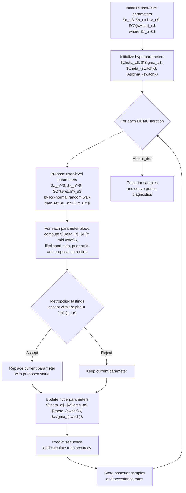

# MCMC Iteration Flow

```mermaid
flowchart TD
    A["Initialize user-level parameters<br/>$a_u$, $s_u=1+z_u$, $C^{switch}_u$<br/>where $z_u>0$"] --> B["Initialize hyperparameters<br/>$\theta_a$, $\Sigma_a$, $\theta_{switch}$, $\sigma_{switch}$"]
    B --> C{"For each MCMC iteration"}

    C --> D["Propose user-level parameters<br/>$a_u^*$, $z_u^*$, $C^{switch*}_u$<br/>by log-normal random walk<br/>then set $s_u^*=1+z_u^*$"]
    D --> E["For each parameter block:<br/>compute $\Delta U$, $P(Y \mid \cdot)$,<br/>likelihood ratio, prior ratio,<br/>and proposal correction"]
    E --> F{"Metropolis-Hastings<br/>accept with $\alpha = \min(1, r)$"}
    F -->|Accept| G["Replace current parameter<br/>with proposed value"]
    F -->|Reject| H["Keep current parameter"]
    G --> I["Update hyperparameters<br/>$\theta_a$, $\Sigma_a$,<br/>$\theta_{switch}$, $\sigma_{switch}$"]
    H --> I

    I --> J["Predict sequence<br/>and calculate train accuracy"]
    J --> K["Store posterior samples<br/>and acceptance rates"]
    K --> C

    C -->|After n_iter| L["Posterior samples<br/>and convergence diagnostics"]
```
